<p align="center">
  
</p>

## 项目使用示例

```shell
python demo.py -i inputs/whole_imgs -o results -v 1.3 -s 2
Usage: python inference_gfpgan.py -i inputs/whole_imgs -o results -v 1.3 -s 2 [options]...

  -h                   show this help
  -i input             Input image or folder. Default: inputs/whole_imgs
  -o output            Output folder. Default: results
  -v version           GFPGAN model version. Option: 1 | 1.2 | 1.3. Default: 1.3
  -s upscale           The final upsampling scale of the image. Default: 2
  -bg_upsampler        background upsampler. Default: realesrgan
  -bg_tile             Tile size for background sampler, 0 for no tile during testing. 		Default: 400
  -suffix              Suffix of the restored faces
  -only_center_face    Only restore the center face
  -aligned             Input are aligned faces
  -ext                 Image extension. Options: auto | jpg | png, auto means using the same extension as inputs. Default: auto
```


## 不同型号版本的比较

- **注意V1.3并不总是比V1.2好，可能需要根据您的目的和输入尝试不同的模型**

| Version |                          Strengths                           |                        Weaknesses                        |
| :-----: | :----------------------------------------------------------: | :------------------------------------------------------: |
|  V1.3   | ✓ natural outputs<br> ✓better results on very low-quality inputs <br> ✓ work on relatively high-quality inputs <br>✓ can have repeated (twice) restorations | ✗ not very sharp <br> ✗ have a slight change on identity |
|  V1.2   |          ✓ sharper output <br> ✓ with beauty makeup          |               ✗ some outputs are unnatural               |

- [GFPGANv1.pth](https://github.com/TencentARC/GFPGAN/releases/download/v0.1.0/GFPGANv1.pth) with colorization and need cuda 
  support
- [GFPGANCleanv1-NoCE-C2.pth](https://github.com/TencentARC/GFPGAN/releases/download/v0.2.0/GFPGANCleanv1-NoCE-C2.pth)
- [GFPGANv1.3.pth](https://github.com/TencentARC/GFPGAN/releases/download/v1.3.0/GFPGANv1.3.pth) 

For the following images, you may need to **zoom in** for comparing details, or **click the image** to see in the full size.

|                            Input                             |                              V1                              |                             V1.2                             |                             V1.3                             |
| :----------------------------------------------------------: | :----------------------------------------------------------: | :----------------------------------------------------------: | :----------------------------------------------------------: |
|  | 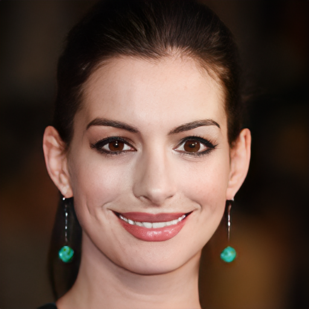 |  | 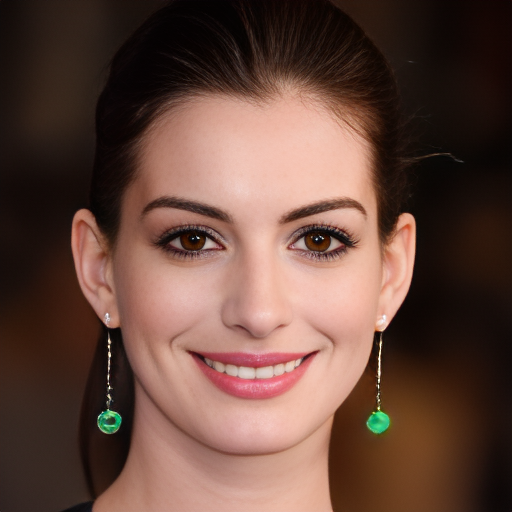 |
|  |  |  |  |
|  | 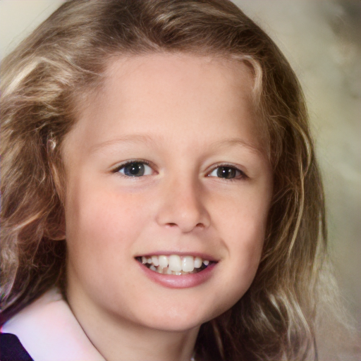 | 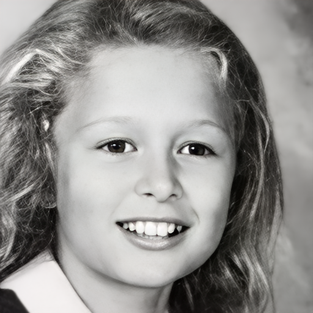 | 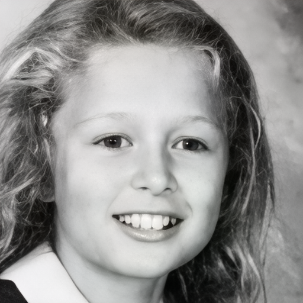 |
|  |  | 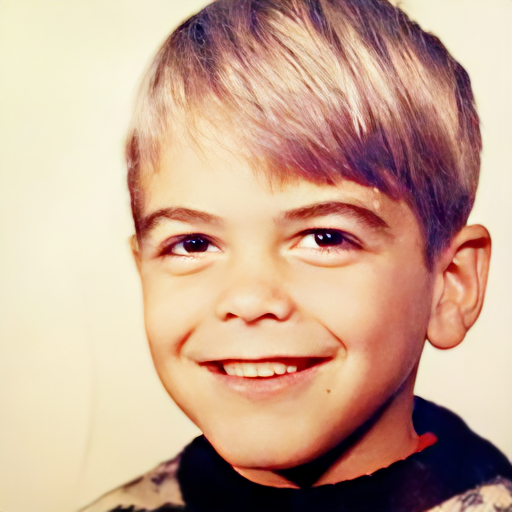 | 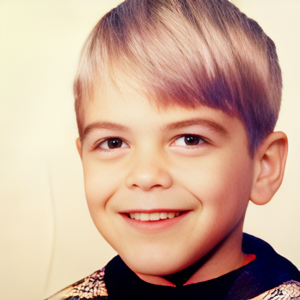 |
|  | 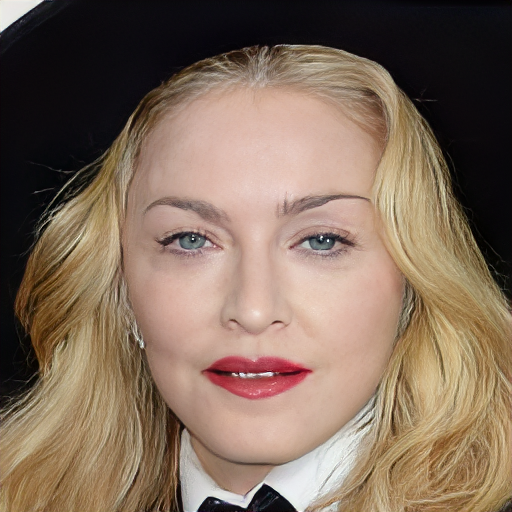 | 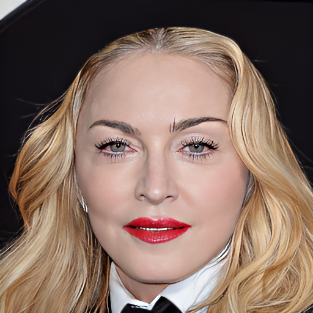 |  |
| 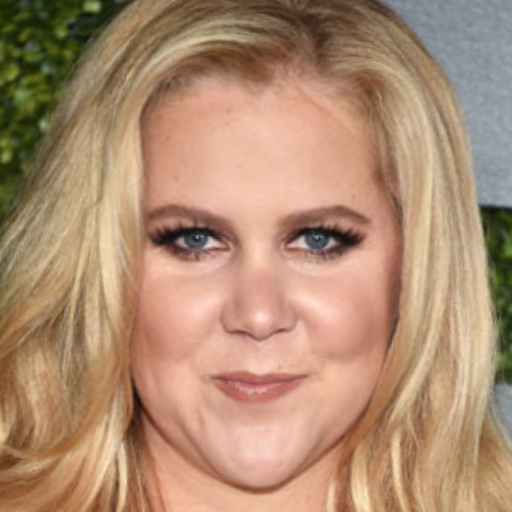 | 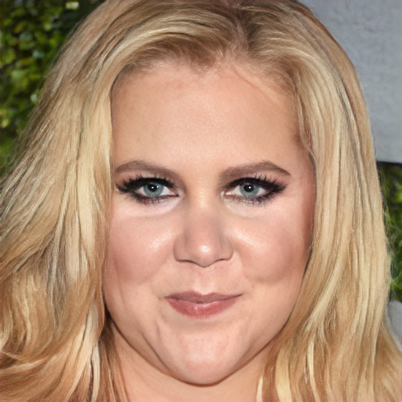 | 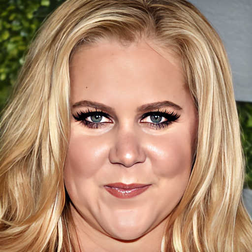 |  |
|  |  | 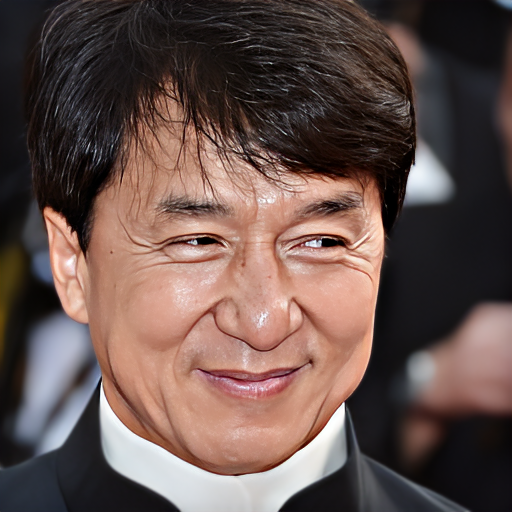 | 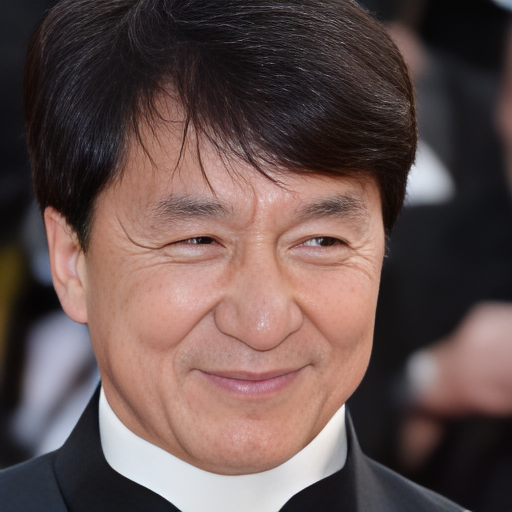 |
